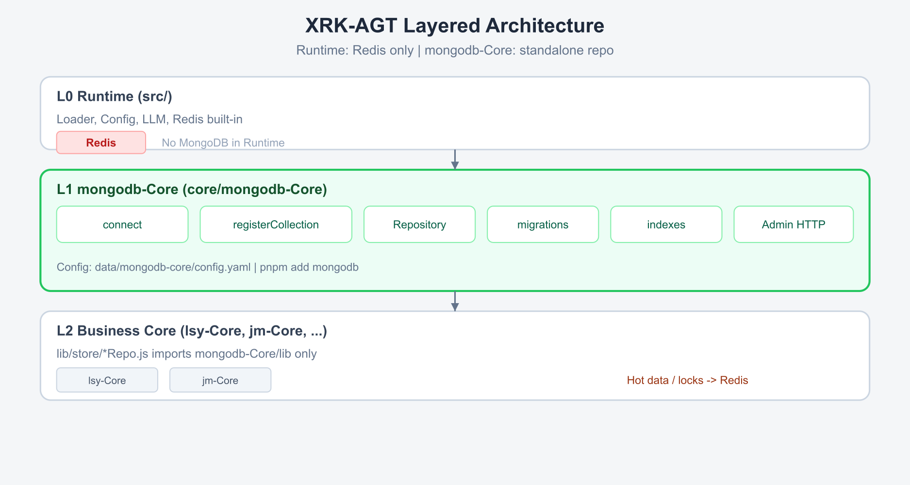
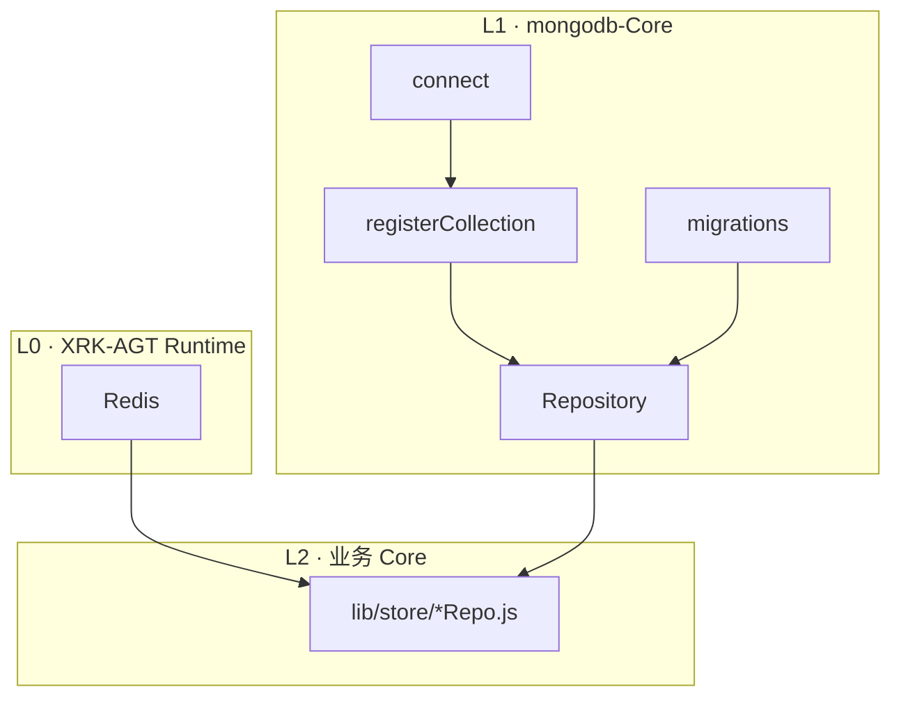

<div align="center">

<br>

# 🍃 mongodb-Core

**MongoDB 持久化层 · 集合注册 · Repository · 迁移 · 索引 · 管理 API**

<sub>XRK-AGT 业务 Core · 安装于宿主 `core/mongodb-Core`</sub>

<br>

[](https://github.com/sunflowermm/XRK-AGT)
[](https://www.mongodb.com/)

<br>

[安装](#安装) · [架构](#架构) · [API](#api-文档) · [快速开始](#快速开始) · [配置](#配置) · [HTTP](#http-api) · [迁移](#迁移) · [约定](#开发约定)

<br>

</div>

---

## 概述

mongodb-Core 为 XRK-AGT 提供 MongoDB 连接、集合命名空间、Repository 基类、版本化迁移与索引管理。业务 Core 通过 `lib/index.js` 访问数据层，无需自行维护连接与集合命名。

| 项 | 说明 |
|---|---|
| 运行环境 | [XRK-AGT](https://github.com/sunflowermm/XRK-AGT)（Node ≥ 26） |
| 安装路径 | `core/mongodb-Core/` |
| 依赖 | 本 Core `package.json` 声明 `mongodb`；MongoDB 服务需自行部署 |
| 与 Runtime | XRK-AGT 内置 Redis；MongoDB 由本 Core 独立初始化 |

---

## 安装

```bash
cd XRK-AGT/core
git clone https://github.com/sunflowermm/mongodb-Core.git mongodb-Core
cd ..
pnpm install
node app
```

首次启动时，配置从 `core/mongodb-Core/default/mongodb-core.yaml` 复制到 `data/mongodb-core/config.yaml`。

本 Core 自带 `package.json`（workspace 依赖 `mongodb`）；引用 Runtime 须用相对路径（如 `../../../src/utils/...`），勿用宿主 `#` 别名。

---

## 架构





| 层级 | 职责 |
|---|---|
| Runtime | 进程启动、Redis、插件与 HTTP 路由 |
| mongodb-Core | 建连、集合注册、CRUD 基类、迁移与索引 |
| 业务 Core | 实体 Repository、领域逻辑 |

目录结构见 [API 文档 · 模块](./docs/API.md#模块结构)。

---

## API 文档

函数签名、参数与示例见 **[`docs/API.md`](./docs/API.md)**。

| API | 说明 |
|---|---|
| `registerCollection(owner, entity, options?)` | 注册集合 `<owner>_<entity>` |
| `Repository` | MongoDB CRUD 基类 |
| `bootstrap()` / `MongoService` | 启动初始化与全局访问 |
| `runMigrations()` | 执行版本化迁移 |
| `withTransaction(fn)` | 副本集事务 |

---

## 快速开始

### 注册集合并实现 Repository

```javascript
import { registerCollection, Repository } from '../../../mongodb-Core/lib/index.js';

const ORDERS = registerCollection('shop', 'orders', {
  indexes: [{ key: { orderId: 1 }, unique: true }],
});

export class OrderRepo extends Repository {
  constructor() {
    super(ORDERS);
  }

  byOrderId(orderId) {
    return this.findOne({ orderId });
  }
}
```

### 在插件中访问

Bootstrap 完成后可使用全局 `MongoService`：

```javascript
await MongoService.getCollection('shop_orders').findOne({ orderId: 'x' });
```

---

## 配置

| 项 | 路径 |
|---|---|
| 默认模板 | `core/mongodb-Core/default/mongodb-core.yaml` |
| 运行时 | `data/mongodb-core/config.yaml` |
| 控制台 | CommonConfig → MongoDB-Core |

| 字段 | 说明 | 默认 |
|---|---|---|
| `connection.host` | 主机 | `127.0.0.1` |
| `connection.port` | 端口 | `27017` |
| `connection.database` | 库名 | `xrk_agt` |
| `runMigrationsOnBoot` | 启动执行迁移 | `true` |
| `ensureIndexesOnBoot` | 启动创建声明索引 | `true` |
| `collectionPrefix` | 全局集合前缀 | 空 |

---

## HTTP API

| 方法 | 路径 | 响应 |
|---|---|---|
| `GET` | `/api/mongodb-core/health` | 连接与迁移状态 |
| `GET` | `/api/mongodb-core/collections` | 已注册集合 |
| `GET` | `/api/mongodb-core/admin/stats` | 文档数与索引数 |

---

## 迁移

迁移脚本位于 `migrations/**/*.js`，每个文件导出 `{ id, up(db) }`：

```javascript
export default {
  id: '002_shop_users',
  async up(db) {
    await db.collection('shop_users').createIndex({ openId: 1 }, { unique: true });
  },
};
```

执行记录保存在 `_mongodb_core_migrations` 集合。

---

## 开发约定

1. 数据访问统一经 `mongodb-Core/lib`，不在业务代码中实例化 `MongoClient`。
2. 集合通过 `registerCollection('<core>', '<entity>')` 注册，物理名为 `<core>_<entity>`（可选前缀见配置）。
3. 需持久化的业务数据写入 MongoDB；会话、锁与计数使用 Runtime Redis。
4. 每个实体对应一个 Repository 文件，建议路径 `core/<产品>/lib/store/`。

---

## 相关 Core

| Core | 场景 |
|---|---|
| **mongodb-Core** | 文档型、Schema 灵活的业务数据 |
| [postgres-Core](https://github.com/sunflowermm/postgres-Core) | 事务、关系查询、报表 |
| [vector-Core](https://github.com/sunflowermm/vector-Core) | 向量检索、RAG 召回 |
| Runtime Redis | 缓存、分布式锁、短期状态 |

选型示意见 [`img/db-cores-family.png`](./img/db-cores-family.png)。

### 与 system-Core `database` stream 的区别

| | `database` stream | mongodb-Core |
|---|---|---|
| 用途 | Agent 本地文件知识库（MCP） | 业务 MongoDB 持久化 |
| 存储 | `~/.xrk/knowledge` | MongoDB 集群 |
| 调用方 | LLM 工具 | 业务 Repository |

---

## 链接

- [API 参考](./docs/API.md)
- [XRK-AGT 文档 · Redis](https://github.com/sunflowermm/XRK-AGT/blob/main/docs/database.md)
- [AGENTS.md](./AGENTS.md)（产品 Agent 规则）
